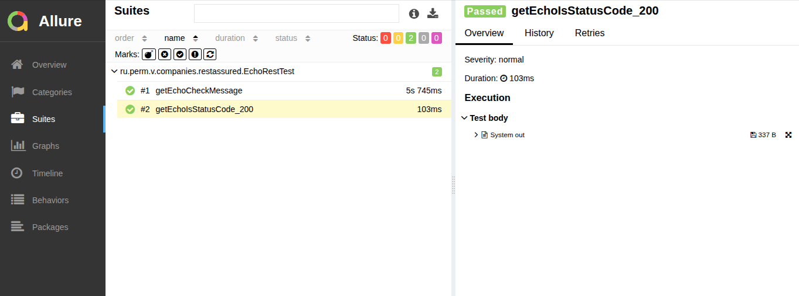

## Behave тестирование RestAssured проекта Dagger_Rest

Для проведения тестов использован RestAssured<br/>
 [https://github.com/rest-assured/rest-assured](https://github.com/rest-assured/rest-assured/wiki/GettingStarted).

Для просмотра отчетов Allure [https://docs.qameta.io/allure/](https://docs.qameta.io/allure/)

Скрипты выполнять из папки проекта с тестами Rest Assured. 
Перед запуском тестов нужно запустить сам проект:
[https://github.com/cherepakhin/dagger_rest](https://github.com/cherepakhin/dagger_rest)

Инициализация maven wrapper:

````shell
mvn -N wrapper:wrapper -Dmaven=3.5.2
````

### Проведение теста

```shell
/dagger_rest_test$ ./mvnw clean test
# Просмотр отчета в браузере
/dagger_rest_test$ ./allure serve target/surefire-reports/
```

Отчет Allure Report 



### Закладки

https://docs.qameta.io/allure/
https://allure-framework.github.io/allure-demo/5/#suites/a2891ce60e520f56ae25e6caf68ea773/448aea45096280d4/

~/prog/java/allure-examples/allure-junit5

````shell
$ cd ~/prog/java/allure-examples/allure-junit5
$ mvn clean test
$ allure serve allure-results/
````

~/prog/java/allure-examples/allure-junit5-example

````shell
$ cd ~/prog/java/allure-examples/allure-junit5-example
$ mvn clean test
$ ~/prog/java/allure-examples/allure-junit5-example$ allure serve allure-results/
````

